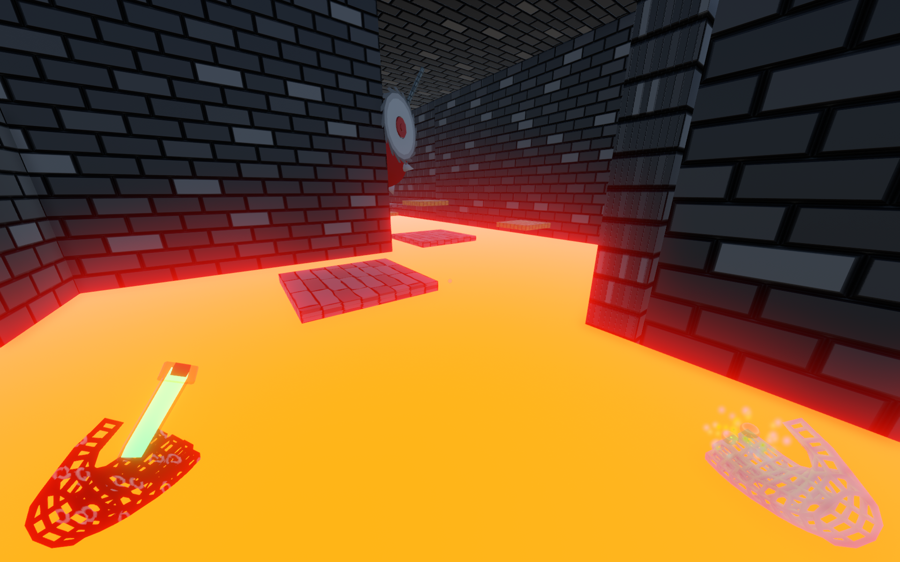
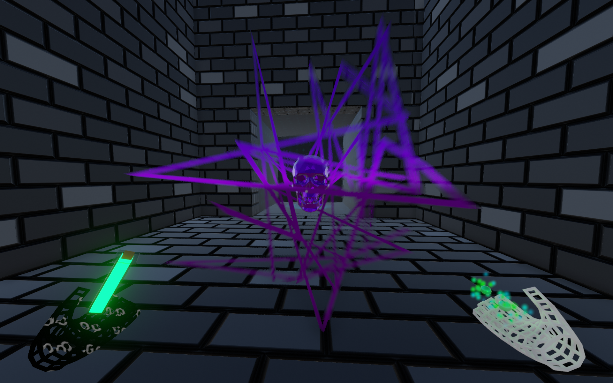
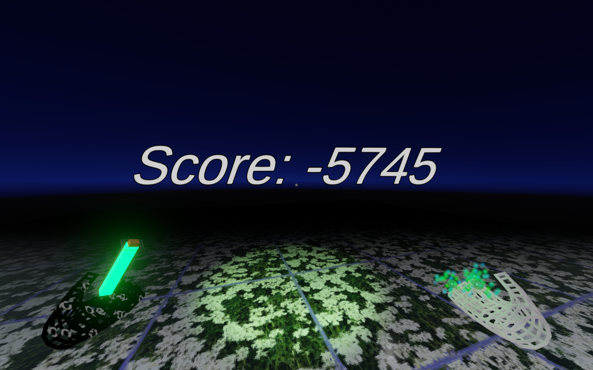

## This is a videogame repo!

---

# Features:

- Somewhat fleshed out movement system!
- Procedurally generated levels!
- Platforming fun!
- The Skull™️!

# Screenshots:

Dazzling Sights!

Exotic Creatures!

A chance for an introspection...?

---

CC Licensed stuff:

"Skull downloadable" (https://skfb.ly/JrST) by martinjario is licensed under Creative Commons Attribution (http://creativecommons.org/licenses/by/4.0/).

Usage Control Model by [Aldous Ichnite](https://freemusicarchive.org/music/aldous-ichnite/contact) is licensed under a [Attribution-NonCommercial 4.0 International License](https://creativecommons.org/licenses/by-nc/4.0).

An Answer in the Ground by [Mid-Air Machine](https://freemusicarchive.org/music/Ask%20Again/contact) is licensed under a [Attribution-NoDerivatives 4.0 International License](https://creativecommons.org/licenses/by-nd/4.0). 

Wrecked by [Viscid](https://freemusicarchive.org/music/viscid/contact) is licensed under a [Attribution-NonCommercial-NoDerivatives 4.0 International License](https://creativecommons.org/licenses/by-nc-nd/4.0/). 